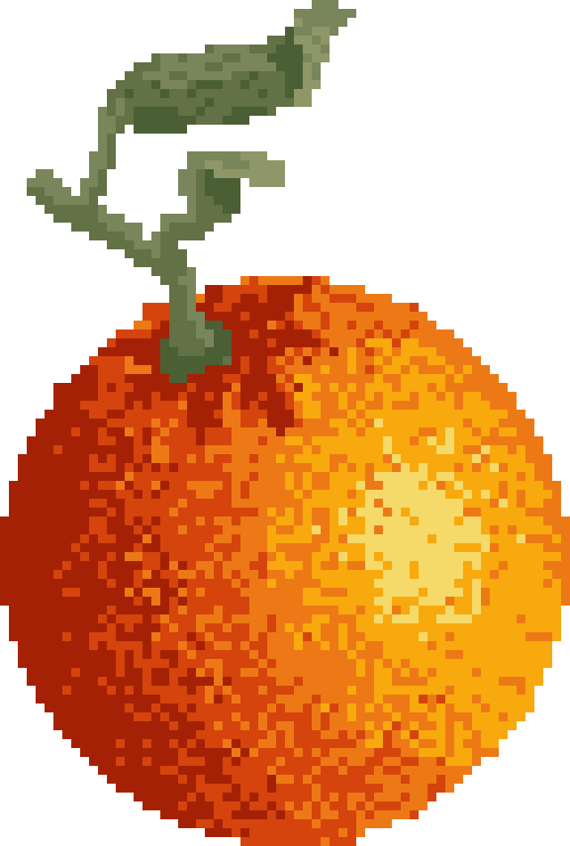

## Hai everybody! 🧡
My name is Orenge (or whatever I go by on the internet). I am a free software enthusiast and an amateur C++ developer. I enjoy learning about new topics as well as expanding on what I already know about.

 <h4> More stuff about me </h4> 

<h2 align="center"> 🍊 About Me 🍊 </h2>
<table width="100%" align="center">
<tr>
  <th> 📙 Have (Some) Experiences in </th>
  <th> 🔬 Currently Learning/Researching </th>
  <th> ✨ My Interests </th>
</tr>
<tr> 
  <td><ui>
    <li> 🎖️ C++ </li>
    <li> 🐍 Python </li>
    <li> 🐧 GNU/Linux </li>
    
&emsp;&emsp;&emsp;&emsp;&emsp;&emsp;&emsp;&emsp;&emsp;&emsp;&emsp;&emsp;&emsp;&emsp;&emsp;&emsp;&emsp;

  </ui>
  <td><ui>
    <li> 🫖 3d Modeling </li>
    <li> 🏃 Animation </li>
    <li> 🎨 Pixel Arts </li>
  </ui>
    
&emsp;&emsp;&emsp;&emsp;&emsp;&emsp;&emsp;&emsp;&emsp;&emsp;&emsp;&emsp;&emsp;&emsp;&emsp;&emsp;&emsp;

  </td>
  <td><ui>
    <li> 💻 Coding (duh) </li>
    <li> 🎮 Video Games </li>
    <li> 🆎 Linguistics </li>
  </ui>
    
&emsp;&emsp;&emsp;&emsp;&emsp;&emsp;&emsp;&emsp;&emsp;&emsp;&emsp;&emsp;&emsp;&emsp;&emsp;&emsp;&emsp;

  </td>
</tr>
</table>

<h2 align="center"> 🛠️ My Toolsets 🛠️ </h2>
<table width="100%" align="center">
<tr>
  <th> 💻 Development </th>
  <th> 🎨 Media </th>
</tr>
<tr> 
  <td><ui>
    <li> 🌳 Evironment: 🪟-11 + <a href="https://github.com/yuk7/ArchWSL"> ArchWSL </a></li>
    <li> 📝 Editor: <a href="https://code.visualstudio.com/">VSCode</a> with 🟩 <a href="https://marketplace.visualstudio.com/items?itemName=vscodevim.vim"> Vim </a> plugin</li>
    <li> ⚙️ C/C++ Compiler: <a href="https://winlibs.com/">WinLibs(GCC)</a> </li>
  </ui>
    
&emsp;&emsp;&emsp;&emsp;&emsp;&emsp;&emsp;&emsp;&emsp;&emsp;&emsp;&emsp;&emsp;&emsp;&emsp;&emsp;&emsp;&emsp;&emsp;&emsp;&emsp;&emsp;

  </td>
  <td><ui>
     <li> 🖥️ Raster: <a href="https://www.aseprite.org/">Aseprite</a>, <a href="https://www.gimp.org/">GIMP</a> </li>
     <li> 🪨 3D Modelling: <a href="https://www.blockbench.net/">Blockbench</a> </li>
     <li> 🌐 Vector: <a href="https://inkscape.org/">Inkscape</a> </li>
  </ui>
    
&emsp;&emsp;&emsp;&emsp;&emsp;&emsp;&emsp;&emsp;&emsp;&emsp;&emsp;&emsp;&emsp;&emsp;&emsp;&emsp;&emsp;&emsp;&emsp;&emsp;&emsp;&emsp;

  </td>
</tr>
</table>

 

🧩🦋🎭

___
